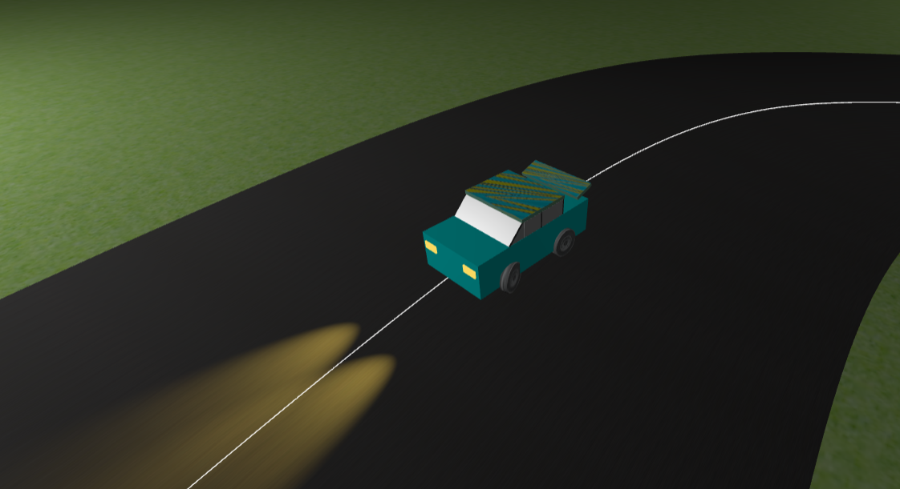
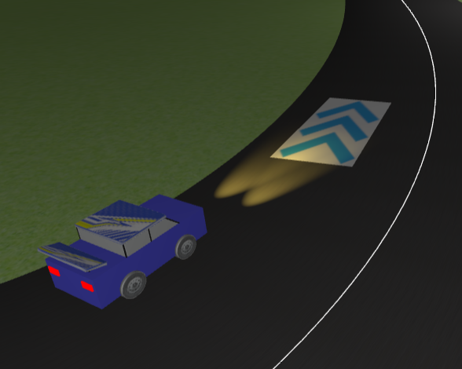
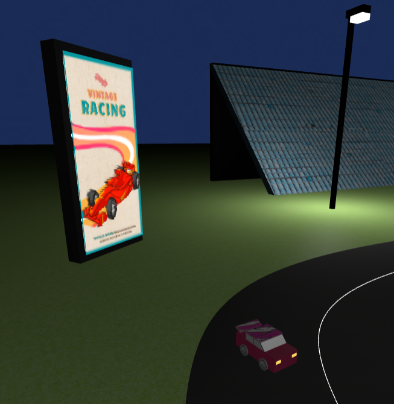

# Car Driving Animation

A small interactive car-driving animation/demo that demonstrates basic vehicle controls, simple physics reactions on collisions, camera modes, and visual elements like wheels and spotlights.

Quick highlights:
- Keyboard controls for driving and camera switching.
- Front wheels steer and rotate visually with the car.
- Two front spotlights follow the car's orientation.
- Simple collision detection producing angular/positional response.
- Off-track detection using points sampled from Catmull–Rom curve segments.

Controls
- W — Accelerate
- S — Brake / Reverse
- A — Turn Left
- D — Turn Right
- Q — Pause / Resume
- E — Switch Camera Mode
- ESC — Quit

Camera modes
- Chase: follows behind the car at a fixed offset.
- Cockpit / Close: near-car / driver view.
- Free: movable or fixed external camera for overview.

Run / Build (example)
- Install required runtime/dependencies (e.g., a browser for WebGL demos, or the appropriate engine runtime).
- Open `index.html` (or the entry file) in a compatible browser or run via a local server:
  - Python: `python -m http.server` then open `http://localhost:8000`
  - Node (http-server): `npx http-server .`
- Use the keyboard controls listed above.

Project structure (important paths)
- screenshots/ — contains example images used in this README (car.png, speed.png, billboard.png).
- src/ or assets/ — (depending on project) contains models, textures, and code for the car and track.
- data/ — contains curve/control point data used for off-track detection (if present).

Features & Notes
- Wheels: front wheels visually steer; wheel spinning matches vehicle velocity.
- Spotlights: front spotlights are attached to the car so their target/orientation updates with vehicle rotation.
- Collision detection: uses x and z coordinates and distance checks for objects/obstacles. Collisions cause simple physical responses (angular displacement and translation).
- Off-track detection: uses sampled points from Catmull–Rom curve segments to determine if the car is off the track.
- Reverse: Car can move backward with the same steering behavior (reduced speed/handling possible depending on implementation).

Troubleshooting
- If visuals aren't visible, ensure textures and models are in the expected paths and the app is served via a local server (some browsers block local file requests).
- If controls don't respond, confirm the window has focus and no other app is capturing keyboard input.

Contributing
- Bug reports and pull requests welcome. Describe steps to reproduce and include platform/runtime details.
- For code changes affecting physics or controls, include short videos or animated GIFs showing the behavior.

License & Credits
- Add your preferred license file (e.g., LICENSE) and credit any third-party assets or libraries used.

Screenshots

---
