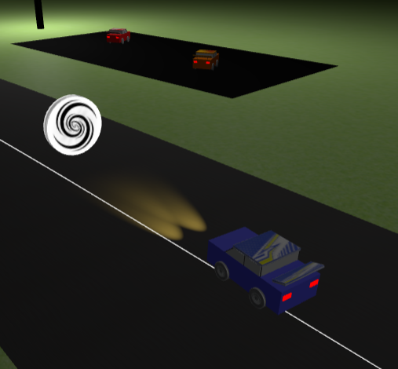

# SGI 2023/2024 - TP3

## Group: T08G09

| Name             | Number    | E-Mail             |
| ---------------- | --------- | ------------------ |
| Diogo Silva         | 202004288 | up202004288@up.pt   |
| Tomás Pires         | 202008319 | up202008319@up.pt   |

----

## Project information

- The scene is composed by a large skybox with a night sky, a ground entirely made of grass, the track with its respective line, light poles, stands for possible spectators, parking lots with player and opponent car options, obstacles park, and a billboard with an ad for the racing event.

- The code is readable, documented and well structured, being organized in folders and multiple files.

---

### Initial Menu

---

- The initial menu uses ThreeJS sprites to create the textual elements needed. The spritesheet contains all letters of the alphabet, digits and other characters. Each symbol is obtained with the coordinates (u, v) mapping.

- The sprites are composed by planes with each character being an object positioned on it.

- The player name input is an input element added to the HTML document.

- When selecting the difficulty level, the one chosen will be highlighted with color (visual indicator).

- This initial menu has the camera facing the player and program parking lots. The player can choose his car and the opponent one. The selected cars will have a sphere above them (visual indicator).

- Object picking (for cars and sprites) uses raycasting, and checks for interceptions with groups and their children (recursively).

- Player cars have different tones of blue (with distinct textures on the roof and spoiler).

- Opponent cars have different tones of red (with distinct textures on the roof and spoiler).

- Player cars have an additional feature (spotlights), to add to the creativity of the game.

- After typing an username, having cars picked on both sides and a difficulty level, the start button is displayed and ready to be clicked on.

----

### Gameplay

---

- The game HUD (heads-up display) is composed by elements in the HTML document, which are constantly updated with the current data.

- Player and opponent classifications are based on the number of current laps by each car.

- The race starts after a count of 3 (displayed on the right).

- The first car to complete 3 laps wins.

- If the player quits the race, the opponent is officially the winner.

- The opponent car follows a keyframe animation, with different positions and variation in car angle. The times are different according to difficulty (normal - 22 seconds; hard - 18 seconds).

- There are 2 camera modes: one with free control and other that constantly follows the player car from behind and with an angle.

**Key Controls:**

    - [W] Accelerate
    - [S] Brake/Reverse
    - [A] Turn Left
    - [D] Turn Right
    - [Q] Pause
    - [E] Switch Camera Mode
    - [ESC] Quit Race

- The wheels turn as the car turns. Also, the 2 front spotlights always maintain their relative position/target to the car.

- The car can move backwards.

- Collision detection uses x and z coordinates and checks distances for each.

- Vehicle collision produces physical effects (change of angle, displacement, etc.).

- Off-track detection uses points obtained from Catmull Rom curve segments, and when it happens, car speed is reduced by 80%.

- There are 2 power-ups on the track, a speed booster (speed with 70% increase for 2 seconds) and a portal (instantaneously places the player car in a point ahead on the track).

- When the player car passes through a power-up, the player is forced to pick an obstacle from the 3 available in the obstacles area. Then, the player should place the chosen obstacle in any location on the track by clicking on it.

- The 3 types of obstacles are: dizzyness (turn left/right commands become switched for 4 seconds), slowness (speed decreased by 60% for 4 seconds) and blocking (car stuck in place for 3 seconds). When the player car hits an obstacle, the corresponding effect is applied.

- Shaders are used in obstacles on the track, giving them a pulsating aspect to the radial dimensions. Also, the obstacles constantly spin on their vertical axis. The original values are considered for collision detection.

- There is a billboard with an ad for the racing event, where shaders are used to add some low relief.

---

### Game Over

---

- ThreeJS sprites are used again in this final menu.

- After a race, the player knows the winner and loser cars, and the respective times.

- There is indication of the difficulty level used in the race.

- There are buttons to either restart the race with the same cars or return to the initial menu.

- Particle system included with different colors and radial explosions, to simulate a firework.

---